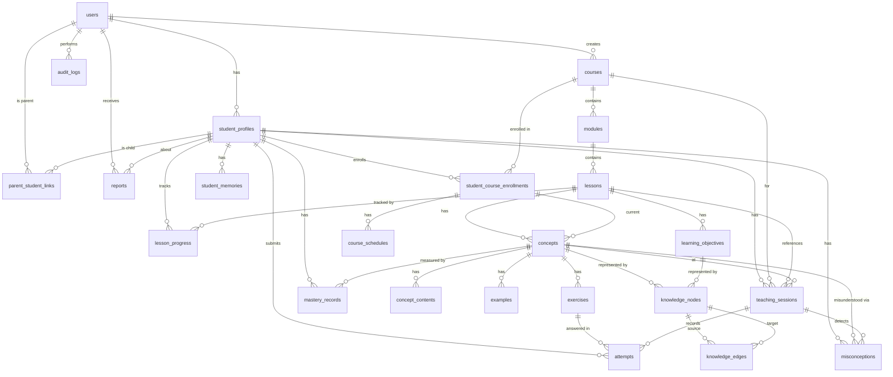

# Database Schema — AI-Native Personalized Schooling Platform

## PostgreSQL Configuration

```sql
-- Required extensions
CREATE EXTENSION IF NOT EXISTS pgcrypto;   -- gen_random_uuid()
CREATE EXTENSION IF NOT EXISTS pg_trgm;    -- trigram indexes for text search
```

---

## Custom ENUM Types

```sql
CREATE TYPE user_role AS ENUM ('admin', 'student', 'parent');
CREATE TYPE lesson_status AS ENUM ('draft', 'published', 'archived');
CREATE TYPE concept_content_type AS ENUM ('explanation', 'example', 'visualization', 'analogy', 'summary');
CREATE TYPE question_type AS ENUM ('mcq', 'multi_select', 'short_answer', 'fill_blank');
CREATE TYPE enrollment_status AS ENUM ('active', 'paused', 'completed', 'dropped');
CREATE TYPE session_state AS ENUM ('active', 'paused', 'completed', 'interrupted');
CREATE TYPE lesson_progress_status AS ENUM ('not_started', 'in_progress', 'completed', 'skipped');
CREATE TYPE misconception_category AS ENUM ('procedural', 'conceptual', 'factual', 'careless');
CREATE TYPE edge_relationship AS ENUM ('requires', 'reinforces', 'contains');
CREATE TYPE pace_status AS ENUM ('on_track', 'behind', 'ahead');
CREATE TYPE report_type AS ENUM ('weekly', 'monthly', 'milestone');
CREATE TYPE node_type AS ENUM ('concept', 'objective');
```

---

## Table Definitions

### 1. `users`

| Column        | Data Type                  | Constraints                  | Notes                      |
|---------------|----------------------------|------------------------------|----------------------------|
| id            | `UUID`                     | `PK DEFAULT gen_random_uuid()` |                            |
| email         | `VARCHAR(255)`             | `NOT NULL`                   |                            |
| password_hash | `VARCHAR(255)`             | `NOT NULL`                   | bcrypt hash                |
| role          | `user_role`                | `NOT NULL`                   |                            |
| full_name     | `VARCHAR(150)`             | `NOT NULL`                   |                            |
| is_active     | `BOOLEAN`                  | `NOT NULL DEFAULT TRUE`      |                            |
| created_at    | `TIMESTAMPTZ`              | `NOT NULL DEFAULT NOW()`     |                            |
| updated_at    | `TIMESTAMPTZ`              | `NOT NULL DEFAULT NOW()`     | Auto-updated via trigger   |

**Unique Constraints:** `UNIQUE (email)`

**Indexes:**
| Index Name     | Column(s)       | Type     |
|----------------|-----------------|----------|
| idx_users_email | email           | BTREE    |
| idx_users_role  | role            | BTREE    |

---

### 2. `student_profiles`

| Column                     | Data Type     | Constraints                  | Notes                    |
|----------------------------|---------------|------------------------------|--------------------------|
| id                         | `UUID`        | `PK DEFAULT gen_random_uuid()` |                          |
| user_id                    | `UUID`        | `NOT NULL`                   | FK → users.id            |
| grade_level                | `VARCHAR(50)` |                              | e.g., "Grade 10"         |
| avg_session_duration_minutes | `INTEGER`   | `DEFAULT 0`                  | Rolling average          |
| current_streak_days        | `INTEGER`     | `DEFAULT 0`                  | Consecutive active days  |
| metadata                   | `JSONB`       | `DEFAULT '{}'`               | Extensible profile data  |
| created_at                 | `TIMESTAMPTZ` | `NOT NULL DEFAULT NOW()`     |                          |
| updated_at                 | `TIMESTAMPTZ` | `NOT NULL DEFAULT NOW()`     |                          |

**Foreign Keys:** `FOREIGN KEY (user_id) REFERENCES users(id) ON DELETE CASCADE`

**Indexes:**
| Index Name                   | Column(s) | Type     |
|------------------------------|-----------|----------|
| idx_student_profiles_user_id | user_id   | BTREE    |

---

### 3. `parent_student_links`

| Column     | Data Type | Constraints                  | Notes          |
|------------|-----------|------------------------------|----------------|
| id         | `UUID`    | `PK DEFAULT gen_random_uuid()` |                |
| parent_id  | `UUID`    | `NOT NULL`                   | FK → users.id  |
| student_id | `UUID`    | `NOT NULL`                   | FK → student_profiles.id |
| created_at | `TIMESTAMPTZ` | `NOT NULL DEFAULT NOW()`  |                |

**Foreign Keys:**
- `FOREIGN KEY (parent_id) REFERENCES users(id) ON DELETE CASCADE`
- `FOREIGN KEY (student_id) REFERENCES student_profiles(id) ON DELETE CASCADE`

**Unique Constraints:** `UNIQUE (parent_id, student_id)`

**Indexes:**
| Index Name                       | Column(s)   | Type     |
|----------------------------------|-------------|----------|
| idx_parent_student_links_parent  | parent_id   | BTREE    |
| idx_parent_student_links_student | student_id  | BTREE    |

---

### 4. `courses`

| Column                | Data Type     | Constraints                  | Notes                    |
|-----------------------|---------------|------------------------------|--------------------------|
| id                    | `UUID`        | `PK DEFAULT gen_random_uuid()` |                          |
| code                  | `VARCHAR(50)` | `NOT NULL`                   | Unique course code       |
| title                 | `VARCHAR(200)`| `NOT NULL`                   |                          |
| description           | `TEXT`        |                              |                          |
| total_duration_hours  | `INTEGER`     | `NOT NULL`                   |                          |
| default_deadline_days | `INTEGER`     | `NOT NULL`                   | Default completion duration |
| is_published          | `BOOLEAN`     | `NOT NULL DEFAULT FALSE`     |                          |
| created_by            | `UUID`        | `NOT NULL`                   | FK → users.id            |
| created_at            | `TIMESTAMPTZ` | `NOT NULL DEFAULT NOW()`     |                          |
| updated_at            | `TIMESTAMPTZ` | `NOT NULL DEFAULT NOW()`     |                          |

**Unique Constraints:** `UNIQUE (code)`

**Foreign Keys:** `FOREIGN KEY (created_by) REFERENCES users(id)`

**Indexes:**
| Index Name        | Column(s)   | Type     |
|-------------------|-------------|----------|
| idx_courses_code  | code        | BTREE    |
| idx_courses_created_by | created_by | BTREE |

---

### 5. `modules`

| Column                   | Data Type     | Constraints                  | Notes                    |
|--------------------------|---------------|------------------------------|--------------------------|
| id                       | `UUID`        | `PK DEFAULT gen_random_uuid()` |                          |
| course_id                | `UUID`        | `NOT NULL`                   | FK → courses.id          |
| title                    | `VARCHAR(200)`| `NOT NULL`                   |                          |
| description              | `TEXT`        |                              |                          |
| order_index              | `INTEGER`     | `NOT NULL`                   |                          |
| estimated_duration_hours | `INTEGER`     |                              |                          |
| created_at               | `TIMESTAMPTZ` | `NOT NULL DEFAULT NOW()`     |                          |
| updated_at               | `TIMESTAMPTZ` | `NOT NULL DEFAULT NOW()`     |                          |

**Foreign Keys:** `FOREIGN KEY (course_id) REFERENCES courses(id) ON DELETE CASCADE`

**Unique Constraints:** `UNIQUE (course_id, order_index)`

**Indexes:**
| Index Name               | Column(s)           | Type     |
|--------------------------|---------------------|----------|
| idx_modules_course_id    | course_id           | BTREE    |
| idx_modules_course_order | course_id, order_index | BTREE |

---

### 6. `lessons`

| Column                    | Data Type         | Constraints                  | Notes                    |
|---------------------------|-------------------|------------------------------|--------------------------|
| id                        | `UUID`            | `PK DEFAULT gen_random_uuid()` |                          |
| module_id                 | `UUID`            | `NOT NULL`                   | FK → modules.id          |
| title                     | `VARCHAR(200)`    | `NOT NULL`                   |                          |
| content_url               | `TEXT`            |                              | External content link    |
| order_index               | `INTEGER`         | `NOT NULL`                   |                          |
| estimated_duration_minutes| `INTEGER`         |                              |                          |
| is_required               | `BOOLEAN`         | `NOT NULL DEFAULT TRUE`      |                          |
| status                    | `lesson_status`   | `NOT NULL DEFAULT 'draft'`   |                          |
| created_at                | `TIMESTAMPTZ`     | `NOT NULL DEFAULT NOW()`     |                          |
| updated_at                | `TIMESTAMPTZ`     | `NOT NULL DEFAULT NOW()`     |                          |

**Foreign Keys:** `FOREIGN KEY (module_id) REFERENCES modules(id) ON DELETE CASCADE`

**Unique Constraints:** `UNIQUE (module_id, order_index)`

**Indexes:**
| Index Name               | Column(s)           | Type     |
|--------------------------|---------------------|----------|
| idx_lessons_module_id    | module_id           | BTREE    |
| idx_lessons_module_order | module_id, order_index | BTREE |
| idx_lessons_status       | status              | BTREE    |

---

### 7. `concepts`

| Column                    | Data Type     | Constraints                  | Notes                    |
|---------------------------|---------------|------------------------------|--------------------------|
| id                        | `UUID`        | `PK DEFAULT gen_random_uuid()` |                          |
| lesson_id                 | `UUID`        | `NOT NULL`                   | FK → lessons.id          |
| title                     | `VARCHAR(200)`| `NOT NULL`                   |                          |
| description               | `TEXT`        |                              |                          |
| order_index               | `INTEGER`     | `NOT NULL`                   |                          |
| estimated_duration_minutes | `INTEGER`    |                              |                          |
| created_at                | `TIMESTAMPTZ` | `NOT NULL DEFAULT NOW()`     |                          |
| updated_at                | `TIMESTAMPTZ` | `NOT NULL DEFAULT NOW()`     |                          |

**Foreign Keys:** `FOREIGN KEY (lesson_id) REFERENCES lessons(id) ON DELETE CASCADE`

**Unique Constraints:** `UNIQUE (lesson_id, order_index)`

**Indexes:**
| Index Name               | Column(s)           | Type     |
|--------------------------|---------------------|----------|
| idx_concepts_lesson_id   | lesson_id           | BTREE    |
| idx_concepts_lesson_order | lesson_id, order_index | BTREE |

---

### 8. `concept_contents`

| Column       | Data Type              | Constraints                  | Notes                         |
|--------------|------------------------|------------------------------|-------------------------------|
| id           | `UUID`                 | `PK DEFAULT gen_random_uuid()` |                               |
| concept_id   | `UUID`                 | `NOT NULL`                   | FK → concepts.id              |
| content_type | `concept_content_type` | `NOT NULL`                   |                               |
| content      | `TEXT`                 | `NOT NULL`                   | The actual teaching content   |
| order_index  | `INTEGER`              | `NOT NULL DEFAULT 0`         | Within content type           |
| version      | `INTEGER`              | `NOT NULL DEFAULT 1`         | Content versioning            |
| created_at   | `TIMESTAMPTZ`          | `NOT NULL DEFAULT NOW()`     |                               |
| updated_at   | `TIMESTAMPTZ`          | `NOT NULL DEFAULT NOW()`     |                               |

**Foreign Keys:** `FOREIGN KEY (concept_id) REFERENCES concepts(id) ON DELETE CASCADE`

**Unique Constraints:** `UNIQUE (concept_id, content_type, order_index)`

**Indexes:**
| Index Name                       | Column(s)          | Type     |
|----------------------------------|--------------------|----------|
| idx_concept_contents_concept_id  | concept_id         | BTREE    |
| idx_concept_contents_type        | concept_id, content_type | BTREE |

---

### 9. `learning_objectives`

| Column             | Data Type     | Constraints                  | Notes                          |
|--------------------|---------------|------------------------------|--------------------------------|
| id                 | `UUID`        | `PK DEFAULT gen_random_uuid()` |                                |
| lesson_id          | `UUID`        | `NOT NULL`                   | FK → lessons.id                |
| code               | `VARCHAR(50)` | `NOT NULL`                   | e.g., "ALG.LIN.01"             |
| description        | `TEXT`        | `NOT NULL`                   |                                |
| success_criterion  | `JSONB`       |                              | Criteria to verify mastery     |
| order_index        | `INTEGER`     | `NOT NULL`                   |                                |
| created_at         | `TIMESTAMPTZ` | `NOT NULL DEFAULT NOW()`     |                                |
| updated_at         | `TIMESTAMPTZ` | `NOT NULL DEFAULT NOW()`     |                                |

**Foreign Keys:** `FOREIGN KEY (lesson_id) REFERENCES lessons(id) ON DELETE CASCADE`

**Unique Constraints:** `UNIQUE (lesson_id, code)`

**Indexes:**
| Index Name                         | Column(s) | Type     |
|------------------------------------|-----------|----------|
| idx_learning_objectives_lesson_id  | lesson_id | BTREE    |
| idx_learning_objectives_code       | code      | BTREE    |

---

### 10. `examples`

| Column       | Data Type     | Constraints                  | Notes                    |
|--------------|---------------|------------------------------|--------------------------|
| id           | `UUID`        | `PK DEFAULT gen_random_uuid()` |                          |
| concept_id   | `UUID`        | `NOT NULL`                   | FK → concepts.id         |
| content      | `TEXT`        | `NOT NULL`                   | Example body             |
| explanation  | `TEXT`        |                              | Why this example works   |
| order_index  | `INTEGER`     | `NOT NULL`                   |                          |
| tags         | `TEXT[]`      |                              | For semantic search      |
| created_at   | `TIMESTAMPTZ` | `NOT NULL DEFAULT NOW()`     |                          |
| updated_at   | `TIMESTAMPTZ` | `NOT NULL DEFAULT NOW()`     |                          |

**Foreign Keys:** `FOREIGN KEY (concept_id) REFERENCES concepts(id) ON DELETE CASCADE`

**Indexes:**
| Index Name               | Column(s)   | Type     |
|--------------------------|-------------|----------|
| idx_examples_concept_id  | concept_id  | BTREE    |
| idx_examples_tags        | tags        | GIN      |

---

### 11. `exercises`

| Column         | Data Type       | Constraints                  | Notes                        |
|----------------|-----------------|------------------------------|------------------------------|
| id             | `UUID`          | `PK DEFAULT gen_random_uuid()` |                              |
| concept_id     | `UUID`          | `NOT NULL`                   | FK → concepts.id             |
| question_type  | `question_type` | `NOT NULL`                   |                              |
| prompt         | `TEXT`          | `NOT NULL`                   | The question text            |
| options        | `JSONB`         |                              | For MCQ / multi-select       |
| correct_answer | `TEXT`          | `NOT NULL`                   |                              |
| difficulty     | `FLOAT`         | `NOT NULL DEFAULT 0.5`       | 0.0 (easy) to 1.0 (hard)    |
| order_index    | `INTEGER`       | `NOT NULL`                   |                              |
| tags           | `TEXT[]`        |                              |                              |
| created_at     | `TIMESTAMPTZ`   | `NOT NULL DEFAULT NOW()`     |                              |
| updated_at     | `TIMESTAMPTZ`   | `NOT NULL DEFAULT NOW()`     |                              |

**Foreign Keys:** `FOREIGN KEY (concept_id) REFERENCES concepts(id) ON DELETE CASCADE`

**Indexes:**
| Index Name                | Column(s)      | Type     |
|---------------------------|----------------|----------|
| idx_exercises_concept_id  | concept_id     | BTREE    |
| idx_exercises_difficulty  | difficulty     | BTREE    |
| idx_exercises_tags        | tags           | GIN      |

---

### 12. `knowledge_nodes`

| Column       | Data Type      | Constraints                  | Notes                              |
|--------------|----------------|------------------------------|------------------------------------|
| id           | `UUID`         | `PK DEFAULT gen_random_uuid()` |                                    |
| concept_id   | `UUID`         |                              | FK → concepts.id (nullable)        |
| objective_id | `UUID`         |                              | FK → learning_objectives.id (nullable) |
| node_type    | `node_type`    | `NOT NULL`                   |                                    |
| label        | `VARCHAR(200)` | `NOT NULL`                   | Human-readable name                |
| metadata     | `JSONB`        | `DEFAULT '{}'`               | Extensible node properties         |
| created_at   | `TIMESTAMPTZ`  | `NOT NULL DEFAULT NOW()`     |                                    |
| updated_at   | `TIMESTAMPTZ`  | `NOT NULL DEFAULT NOW()`     |                                    |

**Foreign Keys:**
- `FOREIGN KEY (concept_id) REFERENCES concepts(id) ON DELETE SET NULL`
- `FOREIGN KEY (objective_id) REFERENCES learning_objectives(id) ON DELETE SET NULL`

**Check Constraints:** `CHECK (concept_id IS NOT NULL OR objective_id IS NOT NULL)`

**Indexes:**
| Index Name                     | Column(s)    | Type     |
|--------------------------------|--------------|----------|
| idx_knowledge_nodes_concept    | concept_id   | BTREE    |
| idx_knowledge_nodes_objective  | objective_id | BTREE    |
| idx_knowledge_nodes_type       | node_type    | BTREE    |
| idx_knowledge_nodes_label      | label        | BTREE    |

---

### 13. `knowledge_edges`

| Column        | Data Type          | Constraints                  | Notes                        |
|---------------|--------------------|------------------------------|------------------------------|
| id            | `UUID`             | `PK DEFAULT gen_random_uuid()` |                              |
| source_node_id| `UUID`             | `NOT NULL`                   | FK → knowledge_nodes.id      |
| target_node_id| `UUID`             | `NOT NULL`                   | FK → knowledge_nodes.id      |
| relationship  | `edge_relationship`| `NOT NULL`                   |                              |
| weight        | `FLOAT`            | `NOT NULL DEFAULT 1.0`       | 0.0–1.0 strength             |
| metadata      | `JSONB`            | `DEFAULT '{}'`               |                              |
| created_at    | `TIMESTAMPTZ`      | `NOT NULL DEFAULT NOW()`     |                              |

**Foreign Keys:**
- `FOREIGN KEY (source_node_id) REFERENCES knowledge_nodes(id) ON DELETE CASCADE`
- `FOREIGN KEY (target_node_id) REFERENCES knowledge_nodes(id) ON DELETE CASCADE`

**Check Constraints:** `CHECK (source_node_id <> target_node_id)`

**Unique Constraints:** `UNIQUE (source_node_id, target_node_id, relationship)`

**Indexes:**
| Index Name                   | Column(s)      | Type     |
|------------------------------|----------------|----------|
| idx_knowledge_edges_source   | source_node_id | BTREE    |
| idx_knowledge_edges_target   | target_node_id | BTREE    |
| idx_knowledge_edges_lookup   | source_node_id, target_node_id, relationship | BTREE |

---

### 14. `student_course_enrollments`

| Column                | Data Type          | Constraints                  | Notes                         |
|-----------------------|--------------------|------------------------------|-------------------------------|
| id                    | `UUID`             | `PK DEFAULT gen_random_uuid()` |                               |
| student_id            | `UUID`             | `NOT NULL`                   | FK → student_profiles.id      |
| course_id             | `UUID`             | `NOT NULL`                   | FK → courses.id               |
| enrolled_at           | `TIMESTAMPTZ`      | `NOT NULL DEFAULT NOW()`     |                               |
| status                | `enrollment_status`| `NOT NULL DEFAULT 'active'`  |                               |
| started_at            | `TIMESTAMPTZ`      |                              | First session start           |
| target_completion_date| `DATE`             |                              | Per-student deadline          |
| completed_at          | `TIMESTAMPTZ`      |                              |                               |
| current_concept_id    | `UUID`             |                              | FK → concepts.id (latest progress) |
| created_at            | `TIMESTAMPTZ`      | `NOT NULL DEFAULT NOW()`     |                               |
| updated_at            | `TIMESTAMPTZ`      | `NOT NULL DEFAULT NOW()`     |                               |

**Foreign Keys:**
- `FOREIGN KEY (student_id) REFERENCES student_profiles(id) ON DELETE CASCADE`
- `FOREIGN KEY (course_id) REFERENCES courses(id) ON DELETE CASCADE`
- `FOREIGN KEY (current_concept_id) REFERENCES concepts(id) ON DELETE SET NULL`

**Partial Unique Index:** `CREATE UNIQUE INDEX idx_active_enrollment ON student_course_enrollments (student_id, course_id) WHERE status = 'active'`

**Indexes:**
| Index Name                           | Column(s)   | Type     |
|--------------------------------------|-------------|----------|
| idx_enrollments_student              | student_id  | BTREE    |
| idx_enrollments_course               | course_id   | BTREE    |
| idx_enrollments_status               | status      | BTREE    |
| idx_enrollments_student_course       | student_id, course_id | BTREE |

---

### 15. `course_schedules`

| Column                   | Data Type        | Constraints                  | Notes                        |
|--------------------------|------------------|------------------------------|------------------------------|
| id                       | `UUID`           | `PK DEFAULT gen_random_uuid()` |                              |
| enrollment_id            | `UUID`           | `NOT NULL`                   | FK → student_course_enrollments.id |
| target_lessons_per_week  | `INTEGER`        | `NOT NULL DEFAULT 3`         |                              |
| current_week             | `INTEGER`        | `NOT NULL DEFAULT 1`         | Week of course               |
| pace_status              | `pace_status`    | `NOT NULL DEFAULT 'on_track'`|                              |
| last_pacing_adjustment_at| `TIMESTAMPTZ`    |                              |                              |
| milestones               | `JSONB`          | `DEFAULT '[]'`               | [{week, expected_concept, deadline}] |
| created_at               | `TIMESTAMPTZ`    | `NOT NULL DEFAULT NOW()`     |                              |
| updated_at               | `TIMESTAMPTZ`    | `NOT NULL DEFAULT NOW()`     |                              |

**Foreign Keys:** `FOREIGN KEY (enrollment_id) REFERENCES student_course_enrollments(id) ON DELETE CASCADE`

**Unique Constraints:** `UNIQUE (enrollment_id)`

**Indexes:**
| Index Name                     | Column(s)      | Type     |
|--------------------------------|----------------|----------|
| idx_course_schedules_enrollment| enrollment_id  | BTREE    |
| idx_course_schedules_pace      | pace_status    | BTREE    |

---

### 16. `teaching_sessions`

| Column              | Data Type        | Constraints                  | Notes                         |
|---------------------|------------------|------------------------------|-------------------------------|
| id                  | `UUID`           | `PK DEFAULT gen_random_uuid()` |                               |
| student_id          | `UUID`           | `NOT NULL`                   | FK → student_profiles.id      |
| course_id           | `UUID`           | `NOT NULL`                   | FK → courses.id               |
| current_concept_id  | `UUID`           |                              | FK → concepts.id               |
| current_lesson_id   | `UUID`           |                              | FK → lessons.id                |
| state               | `session_state`  | `NOT NULL DEFAULT 'active'`  |                               |
| context             | `JSONB`          | `DEFAULT '{}'`               | AI session context for resume  |
| started_at          | `TIMESTAMPTZ`    | `NOT NULL DEFAULT NOW()`     |                               |
| last_activity_at    | `TIMESTAMPTZ`    | `NOT NULL DEFAULT NOW()`     |                               |
| completed_at        | `TIMESTAMPTZ`    |                              |                               |
| created_at          | `TIMESTAMPTZ`    | `NOT NULL DEFAULT NOW()`     |                               |

**Foreign Keys:**
- `FOREIGN KEY (student_id) REFERENCES student_profiles(id) ON DELETE CASCADE`
- `FOREIGN KEY (course_id) REFERENCES courses(id) ON DELETE CASCADE`
- `FOREIGN KEY (current_concept_id) REFERENCES concepts(id) ON DELETE SET NULL`
- `FOREIGN KEY (current_lesson_id) REFERENCES lessons(id) ON DELETE SET NULL`

**Indexes:**
| Index Name                         | Column(s)      | Type     |
|------------------------------------|----------------|----------|
| idx_teaching_sessions_student      | student_id     | BTREE    |
| idx_teaching_sessions_course       | course_id      | BTREE    |
| idx_teaching_sessions_concept      | current_concept_id | BTREE |
| idx_teaching_sessions_active       | (state) WHERE state = 'active' | BTREE (partial) |
| idx_teaching_sessions_last_active  | last_activity_at | BTREE   |

---

### 17. `lesson_progress`

| Column               | Data Type              | Constraints                  | Notes                    |
|----------------------|------------------------|------------------------------|--------------------------|
| id                   | `UUID`                 | `PK DEFAULT gen_random_uuid()` |                          |
| student_id           | `UUID`                 | `NOT NULL`                   | FK → student_profiles.id |
| lesson_id            | `UUID`                 | `NOT NULL`                   | FK → lessons.id          |
| status               | `lesson_progress_status` | `NOT NULL DEFAULT 'not_started'` |                      |
| started_at           | `TIMESTAMPTZ`          |                              |                          |
| completed_at         | `TIMESTAMPTZ`          |                              |                          |
| time_spent_seconds   | `INTEGER`              | `DEFAULT 0`                  |                          |
| completion_percentage| `FLOAT`                | `DEFAULT 0.0`                | 0.0–100.0                |
| created_at           | `TIMESTAMPTZ`          | `NOT NULL DEFAULT NOW()`     |                          |
| updated_at           | `TIMESTAMPTZ`          | `NOT NULL DEFAULT NOW()`     |                          |

**Foreign Keys:**
- `FOREIGN KEY (student_id) REFERENCES student_profiles(id) ON DELETE CASCADE`
- `FOREIGN KEY (lesson_id) REFERENCES lessons(id) ON DELETE CASCADE`

**Unique Constraints:** `UNIQUE (student_id, lesson_id)`

**Indexes:**
| Index Name                       | Column(s)       | Type     |
|----------------------------------|-----------------|----------|
| idx_lesson_progress_student      | student_id      | BTREE    |
| idx_lesson_progress_lesson       | lesson_id       | BTREE    |
| idx_lesson_progress_status       | status          | BTREE    |

---

### 18. `attempts`

| Column              | Data Type     | Constraints                  | Notes                        |
|---------------------|---------------|------------------------------|------------------------------|
| id                  | `UUID`        | `PK DEFAULT gen_random_uuid()` |                              |
| student_id          | `UUID`        | `NOT NULL`                   | FK → student_profiles.id     |
| exercise_id         | `UUID`        | `NOT NULL`                   | FK → exercises.id            |
| teaching_session_id | `UUID`        | `NOT NULL`                   | FK → teaching_sessions.id    |
| response            | `TEXT`        | `NOT NULL`                   | Student's answer             |
| is_correct          | `BOOLEAN`     | `NOT NULL`                   |                              |
| score               | `FLOAT`       |                              | 0.0–1.0                     |
| time_taken_seconds  | `INTEGER`     |                              |                              |
| attempted_at        | `TIMESTAMPTZ` | `NOT NULL DEFAULT NOW()`     |                              |
| attempt_number      | `INTEGER`     | `NOT NULL`                   | Per-exercise attempt count   |
| ai_feedback         | `TEXT`        |                              | AI-generated feedback        |
| metadata            | `JSONB`       | `DEFAULT '{}'`               |                              |

**Foreign Keys:**
- `FOREIGN KEY (student_id) REFERENCES student_profiles(id) ON DELETE CASCADE`
- `FOREIGN KEY (exercise_id) REFERENCES exercises(id) ON DELETE CASCADE`
- `FOREIGN KEY (teaching_session_id) REFERENCES teaching_sessions(id) ON DELETE CASCADE`

**Indexes:**
| Index Name                      | Column(s)          | Type     |
|---------------------------------|--------------------|----------|
| idx_attempts_student            | student_id         | BTREE    |
| idx_attempts_exercise           | exercise_id        | BTREE    |
| idx_attempts_session            | teaching_session_id | BTREE   |
| idx_attempts_student_exercise   | student_id, exercise_id, attempted_at | BTREE |
| idx_attempts_time               | attempted_at       | BTREE    |

---

### 19. `mastery_records`

| Column              | Data Type     | Constraints                  | Notes                    |
|---------------------|---------------|------------------------------|--------------------------|
| id                  | `UUID`        | `PK DEFAULT gen_random_uuid()` |                          |
| student_id          | `UUID`        | `NOT NULL`                   | FK → student_profiles.id |
| concept_id          | `UUID`        | `NOT NULL`                   | FK → concepts.id         |
| mastery_level       | `FLOAT`       | `NOT NULL DEFAULT 0.0`       | 0.0–1.0                 |
| last_attempted_at   | `TIMESTAMPTZ` |                              |                          |
| total_attempts      | `INTEGER`     | `NOT NULL DEFAULT 0`         |                          |
| consecutive_correct | `INTEGER`     | `NOT NULL DEFAULT 0`         | Streak                   |
| next_review_at      | `TIMESTAMPTZ` |                              | Spaced repetition signal |
| created_at          | `TIMESTAMPTZ` | `NOT NULL DEFAULT NOW()`     |                          |
| updated_at          | `TIMESTAMPTZ` | `NOT NULL DEFAULT NOW()`     |                          |

**Foreign Keys:**
- `FOREIGN KEY (student_id) REFERENCES student_profiles(id) ON DELETE CASCADE`
- `FOREIGN KEY (concept_id) REFERENCES concepts(id) ON DELETE CASCADE`

**Unique Constraints:** `UNIQUE (student_id, concept_id)`

**Indexes:**
| Index Name                        | Column(s)          | Type     |
|-----------------------------------|--------------------|----------|
| idx_mastery_records_student       | student_id         | BTREE    |
| idx_mastery_records_concept       | concept_id         | BTREE    |
| idx_mastery_records_lookup        | student_id, concept_id | BTREE |
| idx_mastery_records_review        | next_review_at     | BTREE    |
| idx_mastery_records_level         | mastery_level      | BTREE    |

---

### 20. `misconceptions`

| Column                 | Data Type              | Constraints                  | Notes                         |
|------------------------|------------------------|------------------------------|-------------------------------|
| id                     | `UUID`                 | `PK DEFAULT gen_random_uuid()` |                               |
| student_id             | `UUID`                 | `NOT NULL`                   | FK → student_profiles.id      |
| concept_id             | `UUID`                 | `NOT NULL`                   | FK → concepts.id              |
| category               | `misconception_category` | `NOT NULL`                  |                               |
| description            | `TEXT`                 | `NOT NULL`                   | Human-readable description    |
| detected_at            | `TIMESTAMPTZ`          | `NOT NULL DEFAULT NOW()`     |                               |
| detected_in_session_id | `UUID`                 |                              | FK → teaching_sessions.id     |
| evidence               | `JSONB`                | `DEFAULT '[]'`               | Responses that triggered this |
| frequency              | `INTEGER`              | `NOT NULL DEFAULT 1`         | Times observed                |
| is_resolved            | `BOOLEAN`              | `NOT NULL DEFAULT FALSE`     |                               |
| resolved_at            | `TIMESTAMPTZ`          |                              |                               |
| created_at             | `TIMESTAMPTZ`          | `NOT NULL DEFAULT NOW()`     |                               |
| updated_at             | `TIMESTAMPTZ`          | `NOT NULL DEFAULT NOW()`     |                               |

**Foreign Keys:**
- `FOREIGN KEY (student_id) REFERENCES student_profiles(id) ON DELETE CASCADE`
- `FOREIGN KEY (concept_id) REFERENCES concepts(id) ON DELETE CASCADE`
- `FOREIGN KEY (detected_in_session_id) REFERENCES teaching_sessions(id) ON DELETE SET NULL`

**Indexes:**
| Index Name                       | Column(s)           | Type     |
|----------------------------------|---------------------|----------|
| idx_misconceptions_student       | student_id          | BTREE    |
| idx_misconceptions_concept       | concept_id          | BTREE    |
| idx_misconceptions_session       | detected_in_session_id | BTREE |
| idx_misconceptions_student_concept | student_id, concept_id | BTREE |
| idx_misconceptions_unresolved    | (is_resolved) WHERE is_resolved = FALSE | BTREE (partial) |

---

### 21. `student_memories`

| Column     | Data Type     | Constraints                  | Notes                        |
|------------|---------------|------------------------------|------------------------------|
| id         | `UUID`        | `PK DEFAULT gen_random_uuid()` |                              |
| student_id | `UUID`        | `NOT NULL`                   | FK → student_profiles.id     |
| key        | `VARCHAR(100)`| `NOT NULL`                   | e.g., "pace_preference", "common_stumble_on_fractions" |
| value      | `JSONB`       | `NOT NULL`                   | The observation payload      |
| importance | `FLOAT`       | `NOT NULL DEFAULT 0.5`       | 0.0–1.0 for recall priority  |
| created_at | `TIMESTAMPTZ` | `NOT NULL DEFAULT NOW()`     |                              |
| updated_at | `TIMESTAMPTZ` | `NOT NULL DEFAULT NOW()`     |                              |

**Foreign Keys:** `FOREIGN KEY (student_id) REFERENCES student_profiles(id) ON DELETE CASCADE`

**Unique Constraints:** `UNIQUE (student_id, key)`

**Indexes:**
| Index Name                    | Column(s)       | Type     |
|-------------------------------|-----------------|----------|
| idx_student_memories_student  | student_id      | BTREE    |
| idx_student_memories_key      | student_id, key | BTREE    |
| idx_student_memories_importance | importance   | BTREE    |

---

### 22. `reports`

| Column          | Data Type        | Constraints                  | Notes                    |
|-----------------|------------------|------------------------------|--------------------------|
| id              | `UUID`           | `PK DEFAULT gen_random_uuid()` |                          |
| student_id      | `UUID`           | `NOT NULL`                   | FK → student_profiles.id |
| parent_id       | `UUID`           |                              | FK → users.id            |
| report_type     | `report_type`    | `NOT NULL`                   |                          |
| generated_at    | `TIMESTAMPTZ`    | `NOT NULL DEFAULT NOW()`     |                          |
| summary         | `TEXT`           |                              | AI-generated summary     |
| recommendations | `JSONB`          | `DEFAULT '[]'`               | Actionable items         |
| pdf_url         | `TEXT`           |                              | URL to generated PDF     |
| is_read         | `BOOLEAN`        | `NOT NULL DEFAULT FALSE`     |                          |
| created_at      | `TIMESTAMPTZ`    | `NOT NULL DEFAULT NOW()`     |                          |

**Foreign Keys:**
- `FOREIGN KEY (student_id) REFERENCES student_profiles(id) ON DELETE CASCADE`
- `FOREIGN KEY (parent_id) REFERENCES users(id) ON DELETE SET NULL`

**Indexes:**
| Index Name               | Column(s)       | Type     |
|--------------------------|-----------------|----------|
| idx_reports_student      | student_id      | BTREE    |
| idx_reports_parent       | parent_id       | BTREE    |
| idx_reports_generated    | generated_at    | BTREE    |
| idx_reports_type         | report_type     | BTREE    |

---

### 23. `audit_logs`

| Column      | Data Type     | Constraints                  | Notes                    |
|-------------|---------------|------------------------------|--------------------------|
| id          | `UUID`        | `PK DEFAULT gen_random_uuid()` |                          |
| user_id     | `UUID`        |                              | FK → users.id (nullable for system actions) |
| action      | `VARCHAR(100)`| `NOT NULL`                   | e.g., "lesson.publish", "enrollment.create" |
| entity_type | `VARCHAR(50)` | `NOT NULL`                   | Table name               |
| entity_id   | `VARCHAR(50)` | `NOT NULL`                   | Row UUID as string       |
| old_value   | `JSONB`       |                              | Prior state              |
| new_value   | `JSONB`       |                              | New state                |
| timestamp   | `TIMESTAMPTZ` | `NOT NULL DEFAULT NOW()`     |                          |

**Foreign Keys:** `FOREIGN KEY (user_id) REFERENCES users(id) ON DELETE SET NULL`

**Indexes:**
| Index Name                 | Column(s)   | Type     |
|----------------------------|-------------|----------|
| idx_audit_logs_user        | user_id     | BTREE    |
| idx_audit_logs_entity      | entity_type, entity_id | BTREE |
| idx_audit_logs_timestamp   | timestamp   | BTREE    |
| idx_audit_logs_action      | action      | BTREE    |

---

## Entity Relationship Diagram



---

## Migration Order

Tables must be created in dependency order. Tables at the same level have no inter-dependency and can be created in parallel.

| Order | Table                    | Depends On                         |
|-------|--------------------------|------------------------------------|
| 1     | `users`                  | —                                  |
| 2     | `student_profiles`       | users                              |
| 3     | `courses`                | users                              |
| 4     | `audit_logs`             | users                              |
| 5     | `parent_student_links`   | users, student_profiles            |
| 6     | `modules`                | courses                            |
| 7     | `student_course_enrollments` | student_profiles, courses       |
| 8     | `student_memories`       | student_profiles                   |
| 9     | `reports`                | student_profiles, users            |
| 10    | `lessons`                | modules                            |
| 11    | `course_schedules`       | student_course_enrollments         |
| 12    | `concepts`               | lessons                            |
| 13    | `learning_objectives`    | lessons                            |
| 14    | `lesson_progress`        | student_profiles, lessons          |
| 15    | `concept_contents`       | concepts                           |
| 16    | `examples`               | concepts                           |
| 17    | `exercises`              | concepts                           |
| 18    | `knowledge_nodes`        | concepts, learning_objectives      |
| 19    | `teaching_sessions`      | student_profiles, courses, concepts, lessons |
| 20    | `mastery_records`        | student_profiles, concepts         |
| 21    | `knowledge_edges`        | knowledge_nodes                    |
| 22    | `attempts`               | student_profiles, exercises, teaching_sessions |
| 23    | `misconceptions`         | student_profiles, concepts, teaching_sessions |

### Migration Grouping

For Alembic revision organization, group migrations into batches:

```
V1__base_tables          → users, student_profiles, courses, audit_logs
V2__relationships        → parent_student_links, modules, student_course_enrollments,
                           student_memories, reports
V3__curriculum           → lessons, course_schedules, concepts, learning_objectives,
                           lesson_progress
V4__instructional_content → concept_contents, examples, exercises
V5__knowledge_graph      → knowledge_nodes, knowledge_edges
V6__teaching             → teaching_sessions, mastery_records
V7__assessment           → attempts, misconceptions
```

### Rollback Strategy

- All `ON DELETE CASCADE` ensures referential cleanup on parent deletion.
- ENUM types should be created before any table using them (in a `V0__enums` migration).
- Audit logs and reports are terminal nodes — they can be truncated independently.
