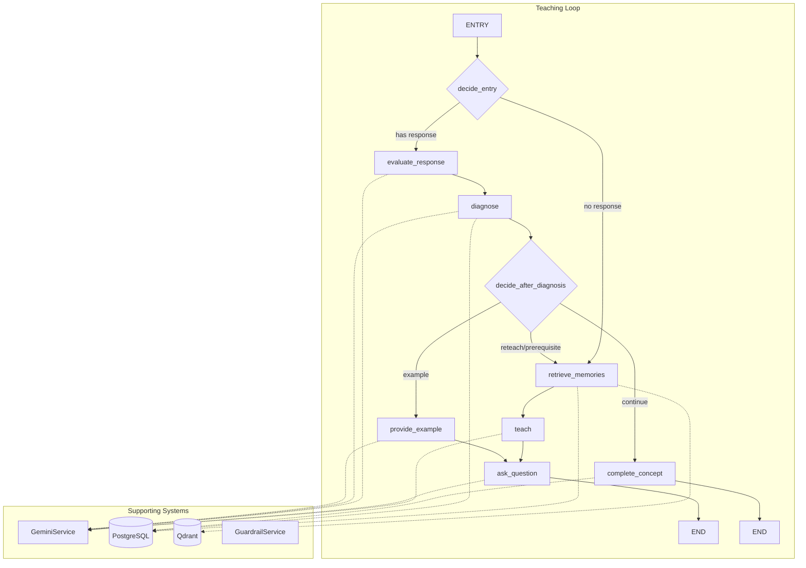
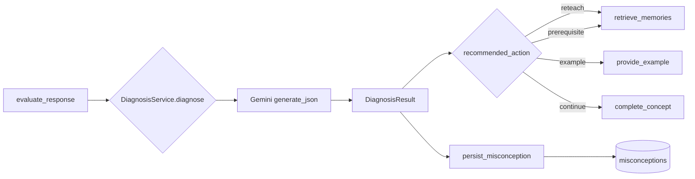
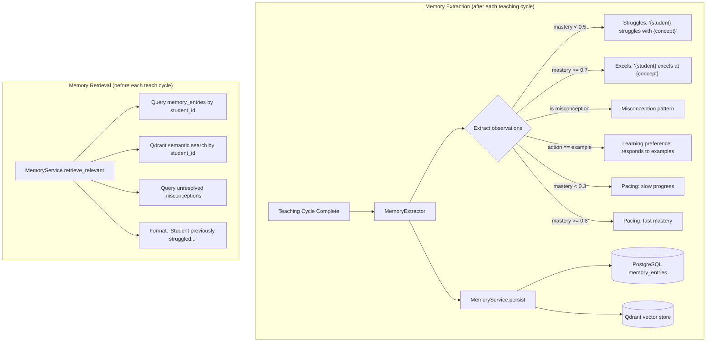
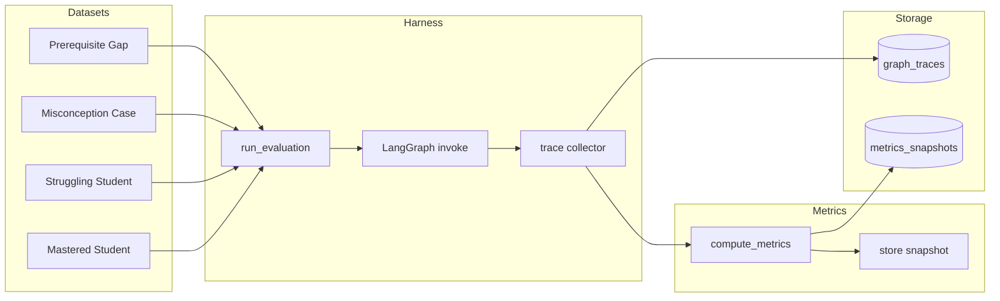
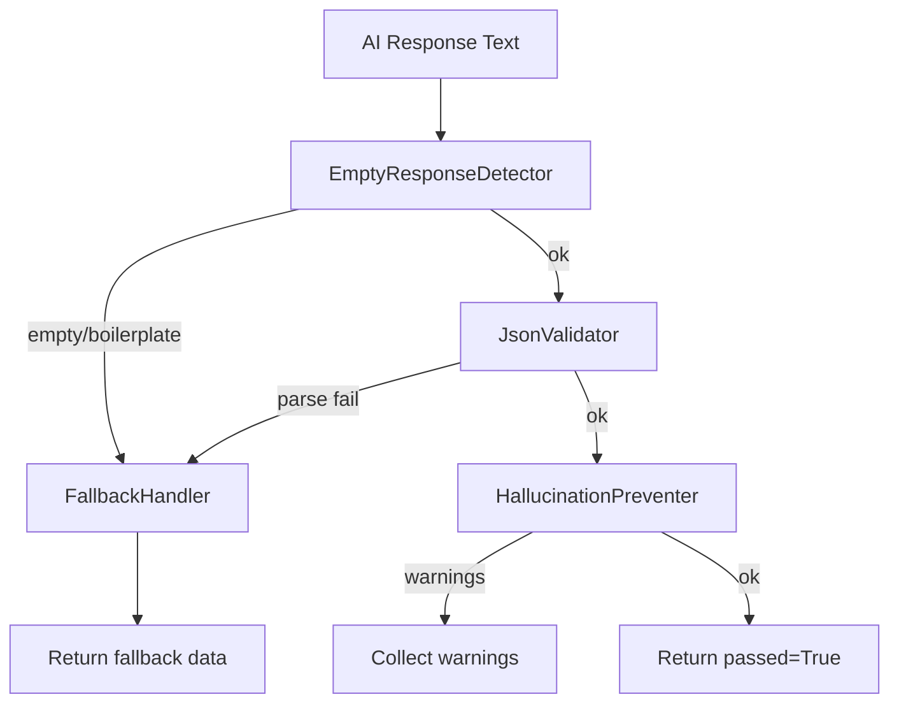

# AI System Audit

## Overview

The AI system is centered around a **LangGraph state machine** that orchestrates 1:1 tutoring. Supporting subsystems handle diagnosis, memory, evaluation, guardrails, and reporting. The system uses **Google Gemini** as the sole LLM provider.



---

## Teacher Graph

### State Schema (`app/ai/state.py`)

```python
class TeacherState(TypedDict):
    # Identifiers
    session_id: str
    student_id: str
    concept_id: str
    lesson_id: str
    course_id: str

    # Current action in the graph
    current_action: TeacherAction  # teach|ask_question|evaluate_response|diagnose|provide_example|complete_concept

    # Conversation
    conversation_history: list[dict]   # [{role, content}]
    student_response: str | None

    # Generated content
    teaching_content: str | None
    question: str | None
    evaluation: dict | None            # {score, feedback, understanding}
    example_content: str | None
    diagnosis_result: dict | None      # {diagnosis_type, recommended_action, ...}
    recommended_action: str | None

    # Concept data
    concept_title: str
    concept_description: str
    concept_content: list[dict]         # [{content, content_type}]
    expected_answer: str | None
    prerequisite_concepts: list[dict]   # [{title, relationship}]
    examples: list[dict]               # [{content, explanation}]

    # Mastery
    mastery_estimate: float

    # Memory
    memory_context: str
    memory_observations: list[dict]

    # Errors
    errors: list[str]
```

### Nodes (7)

| Node | Function File | Input Key | Output Key | Gemini Call |
|------|--------------|-----------|------------|-------------|
| `retrieve_memories` | `nodes/retrieve_memories.py` | `session_id, student_id, concept_id` | `memory_context, memory_observations` | No |
| `teach` | `nodes/teach.py` | `concept_content, memory_context, history` | `teaching_content, current_action=ASK_QUESTION` | `generate()` — produce lesson |
| `ask_question` | `nodes/ask_question.py` | `teaching_content` | `question, current_action=EVALUATE_RESPONSE` | `generate()` — produce question |
| `evaluate_response` | `nodes/evaluate_response.py` | `question, student_response, concept` | `evaluation, mastery_estimate` | `generate_json()` — score+feedback |
| `diagnose` | `nodes/diagnose.py` | `evaluation, concept, history` | `diagnosis_result, recommended_action` | Via `DiagnosisService` → `generate_json()` |
| `provide_example` | `nodes/provide_example.py` | `examples, concept` | `example_content, current_action=ASK_QUESTION` | `generate()` — explain example |
| `complete_concept` | `nodes/complete_concept.py` | history | `current_action=COMPLETE_CONCEPT` | No |

### Entry Decision (`decide_entry`)

```python
if state["student_response"] and state["current_action"] in ("ask_question", "evaluate_response"):
    return "evaluate_response"
else:
    return "retrieve_memories"
```

### Diagnosis Routing (`decide_after_diagnosis`)

| `recommended_action` | Route to | Meaning |
|---------------------|----------|---------|
| `reteach` | `retrieve_memories` | Student didn't understand → reteach with memory context |
| `prerequisite` | `retrieve_memories` | Missing prerequisite knowledge → reteach fundamentals |
| `example` | `provide_example` | Needs concrete example → show worked example |
| `continue` (or other) | `complete_concept` | Understood → end concept |
| _default_ | `example` | Safe fallback |

### Graph Definition (`app/ai/graphs/teacher.py`)

```python
builder = StateGraph(TeacherState)

# Register nodes
builder.add_node("retrieve_memories", retrieve_memories_node)
builder.add_node("teach", teach_node)
builder.add_node("ask_question", ask_question_node)
builder.add_node("evaluate_response", evaluate_response_node)
builder.add_node("diagnose", diagnose_node)
builder.add_node("provide_example", provide_example_node)
builder.add_node("complete_concept", complete_concept_node)

# Entry point
builder.set_conditional_entry_point(decide_entry)

# Fixed edges
builder.add_edge("retrieve_memories", "teach")
builder.add_edge("teach", "ask_question")
builder.add_edge("ask_question", END)
builder.add_edge("evaluate_response", "diagnose")
builder.add_edge("complete_concept", END)
builder.add_edge("provide_example", "ask_question")

# Conditional edge
builder.add_conditional_edges("diagnose", decide_after_diagnosis, {
    "reteach": "retrieve_memories",
    "prerequisite": "retrieve_memories",
    "example": "provide_example",
    "continue": "complete_concept",
})
```

---

## Diagnosis System

### Flow



### DiagnosisResult Schema

| Field | Type | Possible Values |
|-------|------|-----------------|
| `diagnosis_type` | str | `misconception`, `knowledge_gap`, `minor_error`, `mastered` |
| `misconception` | str\|None | Description of specific misconception |
| `misconception_category` | str\|None | `procedural`, `conceptual`, `factual`, `careless` |
| `knowledge_gap` | str\|None | Description of missing prerequisite knowledge |
| `prerequisite_concepts` | list[str] | Concept titles that need review |
| `recommended_action` | str | `reteach`, `prerequisite`, `example`, `continue` |
| `evidence` | list[str] | Evidence from student's response |
| `remediation` | str\|None | Recommended teaching approach |

**File:** `app/ai/diagnosis/schemas.py`, `app/ai/diagnosis/service.py`

---

## Memory System

### Architecture



### Components

| Component | File | Purpose |
|-----------|------|---------|
| `MemoryExtractor` | `memory/extraction.py` | Extracts up to 5 observation types from teaching outcome |
| `MemoryRetriever` | `memory/retrieval.py` | Merges DB + Qdrant + misconception queries |
| `MemoryService` | `memory/service.py` | Orchestrates extraction and retrieval |
| `MemoryObservation` | `memory/schemas.py` | Pydantic model for observations |

**Vector DB:** Qdrant connection is optional — falls back gracefully if unavailable. Embeddings generated via Gemini API (768-dim, Cosine distance).

---

## Evaluation System

### Architecture



### 4 Predefined Scenarios

| Scenario | Student Action | Expected Route |
|----------|---------------|----------------|
| Mastered | Correct answer | evaluate → diagnose → complete_concept |
| Struggling | "I don't know" | evaluate → diagnose → reteach loop |
| Misconception | Confused/partially wrong | evaluate → diagnose → example → question |
| Prerequisite Gap | Missing fundamentals | evaluate → diagnose → prerequisite → reteach |

### Metrics Computed

| Metric | Description |
|--------|-------------|
| `total_sessions` | Number of evaluation runs |
| `concept_mastery_rate` | Proportion reaching complete_concept |
| `remediation_rate` | Proportion triggering reteach/prerequisite |
| `misconception_detection_rate` | Proportion where diagnosis found misconception |
| `prerequisite_routing_frequency` | Proportion routed to prerequisite |
| `session_completion_rate` | Proportion completing without error |
| `avg_mastery_gain` | Average mastery improvement |
| `avg_execution_duration_ms` | Average graph execution time |
| `total_model_calls` | Total Gemini API calls |

**Files:** `app/ai/evaluation/datasets.py`, `harness.py`, `metrics.py`, `reports.py`

---

## Guardrails System



| Component | File | Check |
|-----------|------|-------|
| `EmptyResponseDetector` | `guardrails/empty_detector.py` | Empty text, boilerplate phrases |
| `JsonValidator` | `guardrails/json_validator.py` | Required fields per prompt type |
| `HallucinationPreventer` | `guardrails/hallucination.py` | Disclaimer patterns, score validity |
| `FallbackHandler` | `guardrails/fallback.py` | Hardcoded fallback responses |

---

## Reports Generation

```mermaid
flowchart TD
    REQ[POST /reports/generate/{student_id}] --> VERIFY{Verify parent access}
    VERIFY -->|admin or linked| COLLECT[Collect student data]
    VERIFY -->|denied| FORBIDDEN[403 Forbidden]
    COLLECT --> AGG[Build prompt context]
    AGG --> AI[Gemini generate_json]
    AI -->|success| VALIDATE[Validate report structure]
    AI -->|fail| FALLBACK[Fallback template]
    VALIDATE -->|min items ok| STORE[Store Report in DB]
    VALIDATE -->|too few items| FALLBACK
    STORE --> RESPONSE[Return ReportResponse]
    FALLBACK --> STORE
```

**Report Data Structure:**
```json
{
  "title": "Weekly Learning Update - ...",
  "executive_summary": "...",
  "strengths": [{"description": "...", "category": "academic|engagement|behavior", "evidence": ["..."]}],
  "challenges": [{"description": "...", "category": "conceptual|procedural|...", "severity": "medium|high", "concept_title": "..."}],
  "recommendations": [{"description": "...", "priority": "high|medium|low", "category": "practice|structure|...", "concept_title": "..."}],
  "risk_indicators": [{"risk_type": "pacing|engagement|mastery|...", "description": "...", "severity": "high|medium|low", "actionable": true|false}]
}
```

---

## Gemini Service

**File:** `app/ai/services/gemini.py`

### Methods

| Method | Purpose | Returns |
|--------|---------|---------|
| `generate(prompt, system_instruction)` | Free-form text generation | `str` |
| `generate_json(prompt, system_instruction)` | Structured JSON generation | `dict` |

### Fallback Behavior

- If `GEMINI_API_KEY` is empty: **silently returns mock responses** (no warning logged)
- If API call fails: mock response used
- If JSON parse fails: `{"score": 0.5, "feedback": text, "understanding": "partial"}`

### Configuration

| Setting | Default | Purpose |
|---------|---------|---------|
| `gemini_api_key` | `""` (empty) | Google AI API key |
| `gemini_model` | `gemini-1.5-pro` | Model identifier |

### Prompt Versions

The system has **two prompt registries**:
1. **Inline prompts** in `app/ai/prompts.py` — used directly by graph nodes
2. **V1 prompts** in `app/ai/prompts/v1/` — accessible via `PROMPT_REGISTRY` dict

The V1 prompts are structured as `{"system": "...", "user": "..."}` pairs and cover: teaching, questions, evaluation, examples, diagnosis, reports, memory extraction. The inline prompts have slight differences from their V1 counterparts.

---

## AI Router (Entry Point)

**File:** `app/ai/router.py` — `POST /teacher/teach`

### Request Flow

1. Accept `{session_id, student_response?}` from authenticated user
2. Load `TeachingSession` from DB
3. Load `Concept`, `ConceptContent`, `Example`, prerequisites via knowledge graph
4. Build `TeacherState` from session context
5. Call `teacher_graph.ainvoke(initial_state)`
6. Persist updated session context
7. If diagnosis found: persist `Misconception` via `DiagnosisService.persist_misconception()`
8. Extract & store memories via `MemoryService.extract_and_store()`
9. Return response with: `{action, mastery_estimate, teaching_content?, question?, evaluation?, example_content?, diagnosis_result?}`

### Key Observation

The AI router is the **only** place where the LangGraph is invoked in production. The graph definition, nodes, memory, diagnosis, and guardrails all work together through this single entry point.
